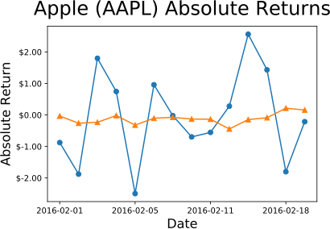
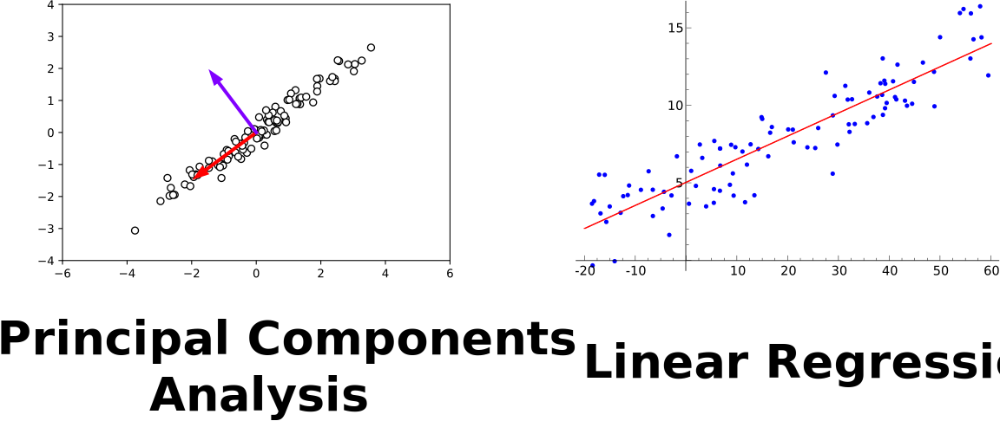
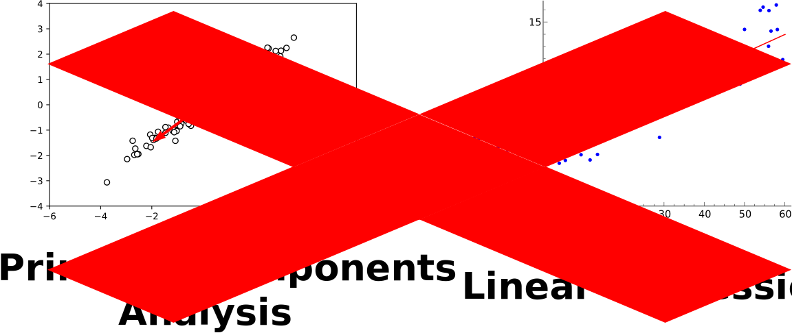
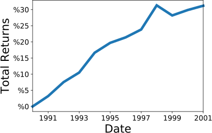
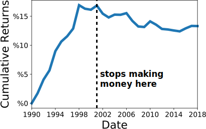
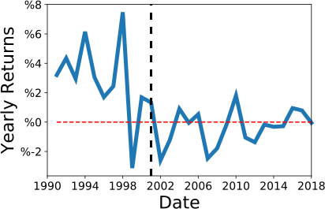
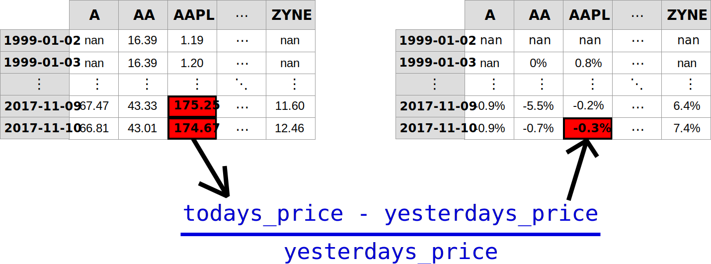
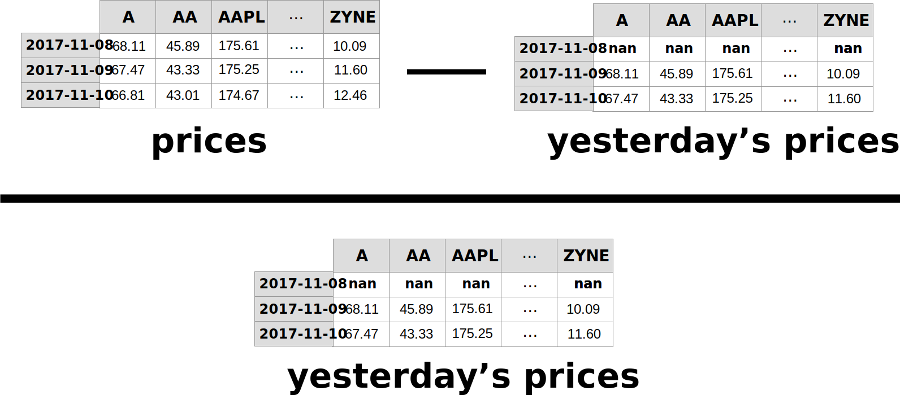
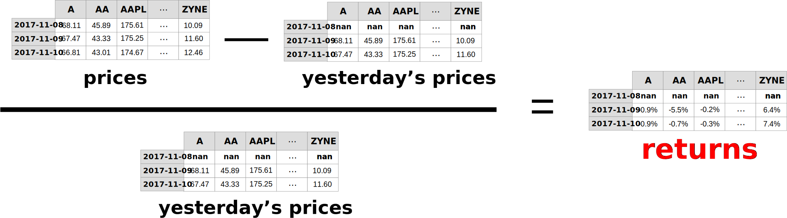

<!-- .slide: data-background="images/intro_background.png" class="background" -->
### **Высокоэффективная обработка данных в Phyton**

#### High Performance Data Processing In Python

<p>
  <a href="http://twitter.com/donald_whyte">@donald_whyte</a>
</p>

<div id="logo-notice">
  
</div>

[NEXT]
### About Me

<div class="left-col">
  
</div>
<div class="right-col" style="text-center: left">
  <ul>
    <li>Software Engineer</li>
    <li>@ Engineers Gate</li>
    <li>Scalable data infrastructure</li>
    <li>Real-time trading systems</li>
    <li>Python/C++/Rust developer</li>
  </ul>
</div>
<div class="clear-col"></div>

[NEXT]
<!-- .slide: class="large-slide" -->
**Python is a hugely popular tool for data analysis.**

[NEXT]

> **Data analysis is now as popular as web development with Python.**

<div class="reference">
  *JetBrains Python Developer Survey 2017* **[1]**
</div>

_note_
https://www.jetbrains.com/research/python-developers-survey-2017/

[NEXT]
# Why?

[NEXT]
## Suitable for **Research**

High-level and easy to use.

Doesn't require advanced programming knowledge.

Enables researchers to iterate on ideas quickly.

[NEXT]
## Suitable for **Production**

General-purpose language useful outside of data analysis.

Huge ecosystem of packages for deploying prod systems.

Deployment, logging, profiling and monitoring.

[NEXT]
## Python's Strengths
Python suitable for **both use cases**.

Enables researchers to run experiments quickly.

Great tools for building prod-ready systems.

[NEXT]
<!-- .slide: class="large-slide" -->
We want to use the same code

for prod **and** research!

[NEXT]
# But...

[NEXT]
## Pure Python is slow!

[NEXT]
## Python vs. C Performance
<div id="python-vs-c-speedups"></div>

<div class="source">
  <p>
    Source: [The Computer Language Benchmarks Game](https://benchmarksgame-team.pages.debian.net/benchmarksgame/faster/python3-gcc.html)
  </p>
</div>

[NEXT]
<!-- .slide: class="large-slide" -->
# Bad for Research

Very slow experimentation cycles.

[NEXT]
<!-- .slide: class="large-slide" -->
# Bad for Production

Cannot run time-sensitive data processing or computational tasks.

[NEXT]
<!-- .slide: class="large-slide" -->
# Solution
Python's data processing ecosystem.

[NEXT]
<!-- .slide: data-background="images/ecosystem.png" -->

[NEXT]
<!-- .slide: data-background="images/ecosystem_marked.png" -->

[NEXT]
## NumPy

<div class="left-col">
  <ul>
    <li>Heart of scientific computing in Python</li>
    <li>Stores and operates on data in C structures</li>
    <li>Avoids slowness of Python</li>
  </ul>
</div>
<div class="right-col">
  <div style="height: 20px"></div>
  
</div>
<div class="clear-col"></div>

[NEXT]
Foundation of most scientific computing packages.


[NEXT]
# Our Focus

[NEXT]
<!-- .slide: class="large-slide" -->
Showing how to use NumPy to process numerical data.

[NEXT]
<!-- .slide: class="large-slide" -->
Exploring how NumPy uses vectorisation to dramatically boost performance.

[NEXT]
<!-- .slide: class="large-slide" -->
While keeping the productivity

Python gives us.

[NEXT]
# Outline
<ol>
  <li class="hidden">Build algo trading strategy using stock price data</li>
  <li class="hidden">Process stock price data in pure Python</li>
  <li class="hidden">Speed up processing using NumPy and vectorisation</li>
  <li class="hidden">Speed up processing even more using Numba</li>
</ol>

[NEXT]
# Outline
<ol>
  <li class="focus">Build algo trading strategy using stock price data</li>
  <li class="hidden">Process stock price data in pure Python</li>
  <li class="hidden">Speed up processing using NumPy and vectorisation</li>
  <li class="hidden">Speed up processing even more using Numba</li>
</ol>

[NEXT]
# Outline
<ol>
  <li class="previous">Build algo trading strategy using stock price data</li>
  <li class="focus">Process stock price data in pure Python</li>
  <li class="hidden">Speed up processing using NumPy and vectorisation</li>
  <li class="hidden">Speed up processing even more using Numba</li>
</ol>

[NEXT]
# Outline
<ol>
  <li class="previous">Build algo trading strategy using stock price data</li>
  <li class="previous">Process stock price data in pure Python</li>
  <li class="focus">Speed up processing using NumPy and vectorisation</li>
  <li class="hidden">Speed up processing even more using Numba</li>
</ol>

[NEXT]
# Outline
<ol>
  <li class="previous">Build algo trading strategy using stock price data</li>
  <li class="previous">Process stock price data in pure Python</li>
  <li class="previous">Speed up processing using NumPy and vectorisation</li>
  <li class="focus">Speed up processing even more using Numba</li>
</ol>

[NEXT]
<!-- .slide: class="large-slide" -->
## Final Optimised Solution

TIME times faster than pure Python.


[NEXT SECTION]
## 1. Let's make some cash!


[NEXT]

<div class="left-col" style="text-center: left">
  <br />
  <p>Use our programmer skills to make money...</p>
  <p>...by building an <strong>automated stock trading strategy!</strong></p>
</div>
<div class="right-col">
  
</div>
<div class="clear-col"></div>

[NEXT]
# The Data

[NEXT]
<!-- .slide: class="large-slide" -->
**Prices of 7000+ US stocks.**

**From 1962 to 2017.**

[NEXT]
<!-- .slide: class="medium-slide" -->
Collection of **CSV** files.


[NEXT]
`aapl.us.txt` <!-- .element: style="font-size: 64px" -->


[NEXT]


[NEXT]
<!-- .slide: class="large-slide" -->
## Total Dataset Size

Over 6,000,000 rows.

1 gigabyte.

[NEXT]
<!-- .slide: class="medium-slide" -->
# Goal
Build an program that generates lists of trades to make.

**One trade list every day.**

[NEXT]
<!-- .slide: class="medium-slide" -->
# Disclaimer!

The following strategy is for demonstration purposes only.

Don't take it as real investment/trading advice.

_note_
TODO: add warning sign unicode to the slides!

[NEXT]
<!-- .slide: class="large-slide" -->
# Positive Note

The strategy's high-level structure **does** reflect what many real world auotmated trading strategies do.

[NEXT]
<!-- .slide: class="large-slide" -->
# How?
We leverage **two fundamental behaviours** about stock prices.

[NEXT]
# 1. Prices Revert to the Mean

[NEXT]


[NEXT]


[NEXT]
<!-- .slide: class="large-slide" -->
# Stock's Daily Return
Represents change in stock price.

[NEXT]
<!-- .slide: class="large-slide" -->
# Stock's Daily Return
Equation:

<code style="font-size: 50px">price_today - price_yesterday</code>

[NEXT]


[NEXT]
<!-- .slide: class="medium-slide" -->
# Mean Reversion Trading Strategy

Buy or sell a stock when its returns exceed a threshold.

[NEXT]


[NEXT]
<!-- .slide: class="large-slide" -->
Suppose we have

**$90,000** to trade with.

[NEXT]
<!-- .slide: class="medium-slide" -->
**Buy:** 1,000 shares at $90 (-$90,000)

**Earned:** <span class="large-pnl">—</span>


[NEXT]
<!-- .slide: class="medium-slide" -->
**Sell** 1,000 shares with $2 return (+$92,000)

**Earned:** ($92,000 - $90,000) = <span class="profit large-pnl">$2,000</span>


[NEXT]
<!-- .slide: class="medium-slide" -->
**Buy:** 1,000 shares at $91 (-$91,000)

**Earned:** <span class="large-pnl">—</span>


[NEXT]
<!-- .slide: class="medium-slide" -->
**Sell:** 1,000 shares with $1 return (+$92,000)

**Earned:** ($92,000 - $91,000) = <span class="profit large-pnl">$1,000</span>


[NEXT]
<!-- .slide: class="medium-slide" -->
**Borrow Sell:** 1,000 shares at $95 (+$95,000)

**Earned:** <span class="large-pnl">—</span>


[NEXT]
<!-- .slide: class="medium-slide" -->
**Buy to Return:** 1,000 shares at $96 (-$96,000)

**Earned:** ($95,000 - $96,000) = <span class="loss large-pnl">-$1,000</span>


[NEXT]
<!-- .slide: class="medium-slide" -->
**Buy:** 1,000 shares at $94 (-$94,000)

**Earned:** <span class="large-pnl">—</span>


[NEXT]
<!-- .slide: class="medium-slide" -->
**Sell:** 1,000 shares at $93.8 (-$93,800)

**Profit:** **Earned:** ($93,800 - $94,000) = <span class="loss large-pnl">-$200</span>


[NEXT]
## The Results

<table>
  <tr><th>Trade Pair</th><th>Profit</th></tr>
  <tr><td>1</td><td><span class="profit">$2,000</span></td></tr>
  <tr><td>2</td><td><span class="profit">$1,000</span></td></tr>
  <tr><td>3</td><td><span class="loss">-$1,000</span></td></tr>
  <tr><td>4</td><td><span class="loss">-$200</span></td></tr>
  <tr>
    <td><span class="large-pnl" style="font-weight: bold">Total</td>
    <td><span class="large-pnl profit">$1,800</span></td>
  </tr>
</table>

[NEXT]
<!-- .slide: class="large-slide" -->
<span class="profit">2%</span> return on investment.

[NEXT]
<!-- .slide: class="large-slide" -->
Make more right trades than wrong trades and you make money.

[NEXT]
<!-- .slide: class="large-slide" -->
# Problem
What if the price **doesn't** revert back to the mean?

[NEXT]
## Price Momentum


[NEXT]
<!-- .slide: class="large-slide" -->
Mean reversion strategy **loses money** if a stock keeps climbing/falling at accelerating speeds!

_note_
Segway into correlation...what if it doesn't revert? Stocks might go down for
legit reasons, e.g. the stock market has gone down as a whole (recession),
so if you buy when it dips it NEVER bounces back and you've lost money .

[NEXT]
<!-- .slide: class="large-slide" -->
Avoid this problem by considering **stock correlation** in trading decisions.


[NEXT]
# 2. Stocks are Correlated

[NEXT]
### Correation with a Stock
#### Apple <-> Amazon


[NEXT]
### Correlation with an Industry
#### Apple <-> The US Stock Market


[NEXT]
<!-- .slide: class="large-slide" -->
# Goal
Avoid trading when stock prices are continously increasing or decreasing.

[NEXT]
<!-- .slide: class="large-slide" -->
Only use **mean reversion** strategy when stocks are hovering around mean.

[NEXT]


[NEXT]


[NEXT]


[NEXT]
<!-- .slide: class="large-slide" -->
Apply mean reversion strategy to:


[NEXT]
<!-- .slide: class="large-slide" -->
Avoid losing money during **momentum** price movements.

[NEXT]
# Beware...

[NEXT]
<!-- .slide: class="large-slide" -->
Adjusting returns using stock correlations is the **hardest** step.

[NEXT]
## Methods for Adjusting Returns



[NEXT]
## Not Going Into Detail!


[NEXT SECTION]
## 2. Pure Python Implementation


[NEXT]
### Short Term Strategy

Whenever we buy or borrow a stock...

...we only keep it for **one day**!

[NEXT]
### Trading Universe

Every day, we choose 4000 out of the 7000 stocks to trade.

Pick the 4000 most traded stocks.

This is our **trading universe**. We only ever trade these stocks.

[NEXT]
Every weekday just before the US stock market closes:

0. choose 4000 stocks to consider trading <!-- .element: class="hidden" -->
1. calculate each stock's daily returns for the past year  <!-- .element: class="hidden" -->
2. calculate correlation between each stock's returns <!-- .element: class="hidden" -->
3. use correlations and yesterday's returns to decide how much to buy/sell of each stock <!-- .element: class="hidden" -->
4. buy/sell decided stocks <!-- .element: class="hidden" -->
5. wait until tomorrow, then get rid of stocks bought/borrowed <!-- .element: class="hidden" -->

[NEXT]
Every weekday just before the US stock market closes:

0. choose 4000 stocks to consider trading <!-- .element: class="focus" -->
1. calculate each stock's daily returns for the past year  <!-- .element: class="hidden" -->
2. calculate correlation between each stock's returns <!-- .element: class="hidden" -->
3. use correlations and yesterday's returns to decide how much to buy/sell of each stock <!-- .element: class="hidden" -->
4. buy/sell decided stocks <!-- .element: class="hidden" -->
5. wait until tomorrow, then get rid of stocks bought/borrowed <!-- .element: class="hidden" -->

[NEXT]
Every weekday just before the US stock market closes:

0. choose 4000 stocks to consider trading <!-- .element: class="previous" -->
1. calculate each stock's daily returns for the past year  <!-- .element: class="focus" -->
2. calculate correlation between each stock's returns <!-- .element: class="hidden" -->
3. use correlations and yesterday's returns to decide how much to buy/sell of each stock <!-- .element: class="hidden" -->
4. buy/sell decided stocks <!-- .element: class="hidden" -->
5. wait until tomorrow, then get rid of stocks bought/borrowed <!-- .element: class="hidden" -->

[NEXT]
Every weekday just before the US stock market closes:

0. choose 4000 stocks to consider trading <!-- .element: class="previous" -->
1. calculate each stock's daily returns for the past year  <!-- .element: class="previous" -->
2. calculate correlation between each stock's returns <!-- .element: class="focus" -->
3. use correlations and yesterday's returns to decide how much to buy/sell of each stock <!-- .element: class="hidden" -->
4. buy/sell decided stocks <!-- .element: class="hidden" -->
5. wait until tomorrow, then get rid of stocks bought/borrowed <!-- .element: class="hidden" -->

[NEXT]
Every weekday just before the US stock market closes:

0. choose 4000 stocks to consider trading <!-- .element: class="previous" -->
1. calculate each stock's daily returns for the past year  <!-- .element: class="previous" -->
2. calculate correlation between each stock's returns <!-- .element: class="previous" -->
3. use correlations and yesterday's returns to decide how much to buy/sell of each stock <!-- .element: class="focus" -->
4. buy/sell decided stocks <!-- .element: class="hidden" -->
5. wait until tomorrow, then get rid of stocks bought/borrowed <!-- .element: class="hidden" -->

[NEXT]
Every weekday just before the US stock market closes:

0. choose 4000 stocks to consider trading <!-- .element: class="previous" -->
1. calculate each stock's daily returns for the past year  <!-- .element: class="previous" -->
2. calculate correlation between each stock's returns <!-- .element: class="previous" -->
3. use correlations and yesterday's returns to decide how much to buy/sell of each stock <!-- .element: class="previous" -->
4. buy/sell decided stocks <!-- .element: class="focus" -->
5. wait until tomorrow, then get rid of stocks bought/borrowed <!-- .element: class="hidden" -->

[NEXT]
Every weekday just before the US stock market closes:

0. choose 4000 stocks to consider trading <!-- .element: class="previous" -->
1. calculate each stock's daily returns for the past year  <!-- .element: class="previous" -->
2. calculate correlation between each stock's returns <!-- .element: class="previous" -->
3. use correlations and yesterday's returns to decide how much to buy/sell of each stock <!-- .element: class="previous" -->
4. buy/sell decided stocks <!-- .element: class="previous" -->
5. wait until tomorrow, then get rid of stocks bought/borrowed <!-- .element: class="focus" -->

[NEXT]
## Always Sell Stock After 1 Day


[NEXT]
## Simulation

Simulate how much money our trading algo would have made historically.

Use pricing data we already have to do this.

[NEXT]
## Simulation Date Range

|                |                    |
| -------------- | ------------------ |
| **Start Date** | 2nd January 1990   |
| **End Date**   | 10th November 2017 |

[NEXT]
<!-- .slide: class="large-slide" -->
Let's write the strategy in

**Pure Python**.

[NEXT]
## Running the Code

```
> python3 -m test_strategy_purepython \
    --stock_price_dir data/stocks \
    --start_date 1990-01-02
    --end_date 2017-11-10
Running simulation from 1990-01-02 to 2017-11-10.
Simulating date 1990-01-02: day's return is 0.000%
Simulating date 1990-01-03: day's return is -1.229%
Simulating date 1990-01-04: day's return is 0.0057%
...
```
<!-- .element: class="large" -->

[NEXT]
# The Result

[NEXT]
## We Make Lots of Money!


[NEXT]
## Summary at End of 2001

<span class="large-pnl">**Returns:** <span class="profit">%27.70</span></span>

|                        |          |
| ---------------------- | -------- |
| **Initial Investment** | $300,000 |
| **Current Value**      | $383,100 |
| **Total Profit**       | $83,100  |

[NEXT]
# Success!
<span style="font-size: 120px">🎉</span>

[NEXT]
# ...or is it?

[NEXT]
## We Stop Making Money...


[NEXT]
## Yearly Returns


[NEXT]
<!-- .slide: class="large-slide" -->
Our first attempt at an automated trading strategy failed!

[NEXT]
<!-- .slide: class="large-slide" -->
## Simulation Time: 1 Month


_note_
TIME: fill in total time taken here

[NEXT]
<!-- .slide: class="medium-slide" -->
# Slow Simulation Time is a Big Problem

[NEXT]
<!-- .slide: class="medium-slide" -->
Strategies always require massive amounts of tuning and experimentation.

Simulations need to run fast.

**Hours, not months!**

[NEXT]
<!-- .slide: class="large-slide" -->
What went wrong?

[NEXT]
<!-- .slide: class="large-slide" -->
<span class="highlighted">3 steps</span> are computationally heavy!

[NEXT]
<!-- .slide: class="hidden-table" -->
### Computationally Heavy Steps

Every day, these steps are run:

|        |                 |                                                        |
| ------ | --------------- | ------------------------------------------------------ |
| **1.** | **Returns**     | calculate each stock's daily returns for the past year |
| **2.** | **Correlation** | calculate correlation between each stock's returns     |
| **3.** | **Decision**    | use correlations and yesterday's returns to decide which stocks buy/sell |

[NEXT]
### Computationally Heavy Steps

Every day, these steps are run:

|        |                 |                                                        |
| ------ | --------------- | ------------------------------------------------------ |
| **1.** | **Returns**     | calculate each stock's daily returns for the past year |
| **2.** | **Correlation** | calculate correlation between each stock's returns     |
| **3.** | **Decision**    | use correlations and yesterday's returns to decide which stocks buy/sell |

[NEXT]
# How Much Computation is Required?

[NEXT]
## Operations Required

| Step            | **Complexity** | **Per Day** | **Full Simulation** |
| --------------- | -------------- | ------------| ------------------- |
| **Returns**     | `O(n)`         | TIME        | TIME                |
| **Correlation** | `O(n^2)`       | TIME        | TIME                |
| **Decision**    | `O(n^3)`       | TIME        | TIME                |

<div class="source">
  <p>
    <strong>operation</strong> is defined as an:
    <br />
    assignment, add, subtract, multiply, divide or comparison
  </p>
</div>

[NEXT]
<!-- .slide: class="large-slide" -->
# Total Operations

TIME

[NEXT]
## Trading Simulation
### Execution Time Breakdown

[NEXT]
**Total time:** TIME hours (TIME secs)

<div id="purepython-times"></div>

[NEXT]
<!-- .slide: class="large-slide" -->
Why is Python so slow?

_note_
Source for upcoming sections: https://jakevdp.github.io/blog/2014/05/09/why-python-is-slow/

# Reason 1
## Dynamic Typing

[NEXT]
<!-- .slide: class="large-slide" -->
The Python interpreter doesn't know the type of variables in advance.


[NEXT]
<!-- .slide: class="large-slide" -->
More instructions needed for any operation.

[NEXT]
<!-- .slide: class="large-slide" -->
The _**primary reason**_ python is slower than natively compliled languages for
processing numerical data.

[NEXT]
# Reason 2
## Interpreted, not Compiled

[NEXT]
<!-- .slide: class="large-slide" -->
Less opportunities for code optimisation.

_note_
Python code is interpreted at runtime.

Quick to iterate, but gives less chance to optimise.

During compilation, a smart compiler can look ahead and optimise inefficient code.

See section 5 to learn see how compiling Python code can dramatically speed up
code.

[NEXT]
# Reason 3
## Fragmented Memory Access

[NEXT]


_note_
Bad for code that steps through **data in sequence**.

Iterate through a single list accesses completely different regions of memory.

[NEXT]
<!-- .slide: class="large-slide" -->
**Not cache friendly**!


[NEXT SECTION]
## 3. Numpy


[NEXT]
## The Foundation
Fundamental package for high performance computing in Python.

Many libraries/frameworks are built on top of NumPy.

[NEXT]
## Features

* multi-dimensional array objects
* routines for fast operations on arrays
  - mathematical, logical, sorting, selecting
* efficient loading/saving of numerical data to disk
  - including CSV

[NEXT]
`numpy.ndarray`

* class encapsulating n-dimensional arrays
* fixed size
* elements must be the same type

_note_
At the core of the NumPy package, is the ndarray object. This encapsulates
n-dimensional arrays of homogeneous data types, with many operations being
performed in compiled code for performance.

[NEXT]
# Examples

[NEXT]
### Creating an Array

```python
>>> a = np.arange(9, dtype=np.float64)
>>> a
array([0., 1., 2., 3., 4., 5., 6., 7., 8.])
>>> a.shape
(9,)
>>> a.strides
(8,)
```
<!-- .element: class="large" -->

[NEXT]
### Memory Layout


_note_
A NumPy array in its simplest form is a Python object build around a C array.
That is, it has a pointer to a contiguous data buffer of values.

`data` is pointer indicating the memory address of the first byte in the array.

`dtype` indicates the type of elements stored in the array.

`shape` indicates the shape of the array. That is, it defines the dimensionality
of the data in the array and how many elements the array stores for each dimension.

The `strides` are the number of bytes that should be skipped in memory to go to the next element. If your strides are (32, 8), you need to proceed 8 bytes to get to the next column and 32 bytes to move to the next row.

`flags` is a set of configurable flags we don't need to cover here.

### Python View


[NEXT]
### Reshape

```python
>>> b = a.reshape(3, 3)
>>> b
array([[0., 1., 2.],
       [3., 4., 5.],
       [6., 7., 8.]])
```


[NEXT]
### Slicing One Dimension

```python
>>> b[:, :2]
array([[0., 1.],
       [3., 4.],
       [6., 7.]])
```


[NEXT]
### Slicing Multiple Dimensions

```python
>>> b[:2, :2]
array([[0., 1.],
       [3., 4.]])
```


[NEXT]
<!-- .slide: class="medium-slide" -->
Reshaping or slicing arrays creates a **view**.

No copies are made.

[NEXT]
## Performance Benefits

* Data stored contiguously
  - no memory overhead
  - cache locality
* No copies for common reshaping/slicing operations
* Fast logical and mathematical operations
  - executed in heavily optimised compiled code

[NEXT]
## Benchmark
### Adding 10,000,000 Numbers

[NEXT]
## Pure Python

```python
a = list(range(10000000))
b = list(range(10000000))

# 1. indexing
c = [a[i] + b[i] for i in range(len(a))]
```
<!-- .element: class="large" -->

[NEXT]
## NumPy

```python
import numpy as np

a = np.arange(10000000)
b = np.arange(10000000)

# 2. loop
c = np.zeros(len(a))
for i in range(len(a)):
    c[i] = a[i] + b[i]

# 3. built-in numpy addition operator
d = a + b
```
<!-- .element: class="large" -->

[NEXT]
## Timing (seconds)
<div id="basic-numpy-benchmark-times"></div>

[NEXT]
## Speedup Factor
<div id="basic-numpy-benchmark-speedup"></div>

[NEXT]
<!-- .slide: class="medium-slide" -->
NumPy with loops is the slowest.

Takes **4x** longer than pure Python!

[NEXT]
### Explicitly Looping over Numpy Array


_note_
For every integer, we're making two `__getitem__` calls, performing the
addition in Python and copying each result into the output numpy array with
a call to `__setitem__`.

This dramatically slows down the computation for two reasons:

1. This adds function call overhead. We invoke four Python functions for each
   integer. That's 40,000,000 function calls.
2. It performs three copies for each addition. It copies the `i`th element of
   `a` and `b`, then copies the addition into `c`.
3. The overhead and copies destroy cache locality. The copies are likely in a
   very different part of the address space, meaning the CPU is having to do
   more work to fetch data from RAM, instead of just using its local cache.

[NEXT]
### Using Built-in Addition


_note_
The full addition logic is executed in native, compiled NumPy code. There are
no function call overheads and no copies.

The memory buffers storing `a` and `b` are directly accessed when adding.
Since those buffers are stored contiguously in memory, we're cache friendly.
The CPU has to fetch less data from RAM.

[NEXT]
## Keep it in NumPy!
Don't loop through `np.ndarray`s.

Move the computation to the NumPy/C/native code level where possible.

[NEXT]
## Problem
For arrays with the same size, operations are performed element-by-element.

Sometimes we want to apply smaller scalars or vectors to larger arrays.

_e.g. adding one to all elements in an array_

_note_
We want to use NumPy's built-in operations, but we don't want to perform loads of copies to match up the array sizes.

[NEXT]
### Adding 1 to an Array


Adding 1 to **N** elements would take **N -1** copies!

[NEXT]
### Broadcasting
Allows us to apply smaller arrays to larger arrays.

**Without copying.**

[NEXT]
### Broadcasting Scalar to Array


[NEXT]
### Broadcasting Scalar to Array


[NEXT]
### Broadcasting Vector to Array


[NEXT]
### Broadcasting Vector to Array


[NEXT]
### Using NumPy for Trading Simulation

[NEXT]
## Recap

Every day, these steps are run:

|        |                 |                                                        |
| ------ | --------------- | ------------------------------------------------------ |
| **1.** | **Returns**     | calculate each stock's daily returns for the past year |
| **2.** | **Correlation** | calculate correlation between each stock's returns     |
| **3.** | **Decision**    | use correlations and yesterday's returns to decide which stocks buy/sell |

[NEXT]
<!-- .slide: class="medium-slide" -->
## The First Step: Returns

Calculate each stock's daily returns for the past year.

[NEXT]
## Relative Percentage Return
<div style="height: 64px"></div>


[NEXT]
## Example

| **Date**   | **AAPL Stock Price** |
| ---------- | -------------------- |
| 2017-08-01 | 148.92               |
| 2017-08-02 | 155.97               |

<div>
  **What is AAPL's return at end of 2017-08-02?**
</div>
<!-- .element: style="font-size: 46px" class="fragment" data-fragment-index="0" -->
<div>
  
</div>
<!-- .element: class="fragment" data-fragment-index="1" -->
[NEXT]
<!-- .slide: class="large-slide" -->
Need to calculate return for all

stocks on all days.

[NEXT]
<!-- .slide: class="large-slide" -->
Could use a nested for loop:

<pre class="large"><code data-noescape class="python">returns = {}
for stock in stocks:
    for date in dates:
      returns[stock] = (todays_price - yesterdays_price)
                       / yesterdays_price
</code></pre>

[NEXT]
# Slow!

[NEXT]
<!-- .slide: class="large-slide" -->
Lots of copies and slow operations being run in Python code.

[NEXT]
<!-- .slide: class="large-slide" -->
**Using NumPy to compute returns:**

1. pack all stock prices for all dates into NumPy matrix <!-- .element: class="fragment" data-fragment-index="0" -->
2. perform bulk operations on matrix to keep computation in C <!-- .element: class="fragment" data-fragment-index="1" -->

[NEXT]
## Stock Price Matrix


[NEXT]
## Stock Return Matrix


[NEXT]


[NEXT]
<!-- .slide: class="large-slide" -->
Instead of manually calculating each
cell one-by-one using Python loops...

[NEXT]
<!-- .slide: class="large-slide" -->
Use bulk matrix-based operations using NumPy.

[NEXT]


[NEXT]


[NEXT]
# Returns Formula
<div style="height: 64px"></div>


[NEXT]
## Insert Full Price Matrices into Returns Formula
<div style="height: 32px"></div>


[NEXT]
## Output: Returns Matrix
<div style="height: 32px"></div>


[NEXT]
## Output: Returns Matrix


[NEXT]
# The NumPy Code

[NEXT]
<pre class="large"><code data-noescape class="python"># Construct empty date x symbol price matrix.
price_matrix = np.zeros(shape=(num_dates_in_sim,
                               num_stocks))

# ...populate price_matrix using CSV files...

# Calculate returns using matrix operations.
shifted_prices = np.roll(price_matrix, shift=1, axis=0)
shifted_prices[:1, :] = np.nan
returns = (price_matrix - shifted_prices)
          / shifted_prices
</code></pre>

[NEXT]
<pre class="large"><code data-noescape class="python"># Construct empty date x symbol price matrix.
<mark>price_matrix = np.zeros(shape=(num_dates_in_sim,
                               num_stocks))</mark>

# ...populate price_matrix using CSV files...

# Calculate returns using matrix operations.
shifted_prices = np.roll(price_matrix, shift=1, axis=0)
shifted_prices[:1, :] = np.nan
returns = (price_matrix - shifted_prices)
          / shifted_prices
</code></pre>

[NEXT]
<pre class="large"><code data-noescape class="python"># Construct empty date x symbol price matrix.
price_matrix = np.zeros(shape=(num_dates_in_sim,
                               num_stocks))

<mark># ...populate price_matrix using CSV files...</mark>

# Calculate returns using matrix operations.
shifted_prices = np.roll(price_matrix, shift=1, axis=0)
shifted_prices[:1, :] = np.nan
returns = (price_matrix - shifted_prices)
          / shifted_prices
</code></pre>

[NEXT]
<pre class="large"><code data-noescape class="python"># Construct empty date x symbol price matrix.
price_matrix = np.zeros(shape=(num_dates_in_sim,
                               num_stocks))

# ...populate price_matrix using CSV files...

# Calculate returns using matrix operations.
<mark>shifted_prices = np.roll(price_matrix, shift=1, axis=0)</mark>
<mark>shifted_prices[:1, :] = np.nan</mark>
returns = (price_matrix - shifted_prices)
          / shifted_prices
</code></pre>

[NEXT]
<pre class="large"><code data-noescape class="python"># Construct empty date x symbol price matrix.
price_matrix = np.zeros(shape=(num_dates_in_sim,
                               num_stocks))

# ...populate price_matrix using CSV files...

# Calculate returns using matrix operations.
shifted_prices = np.roll(price_matrix, shift=1, axis=0)
shifted_prices[:1, :] = np.nan
<mark>returns = (price_matrix - shifted_prices)</mark>
<mark>          / shifted_prices</mark>
</code></pre>

[NEXT]
## How The Returns Matrix is Used

Compute the returns matrix once at start of simulation.

Use slices of matrix for each date of sim. (**no copies!**)

Complete returns matrix is sized **7000 x 7000**.

[NEXT]
## Timings
#### Calculating All Returns
<div id="numpy-returns-times"></div>

[NEXT]
## Speedup
#### Calculating All Returns
<div id="numpy-returns-speedup"></div>

_note_
TIME: poplate these graphs

[NEXT]
<!-- .slide: class="large-slide" -->
We use NumPy to perform similar optimisations for the **Correlation** and
**Decision** steps.

[NEXT]
<!-- .slide: class="medium-slide" -->
# Key Takeway

Expressing data in vector/matrix form opens up a new world of optimisations.

[NEXT]
## Trading Simulation
### Execution Time Breakdown

[NEXT]
**Total time:** TIME hours ⟶ TIME hours

**Speedup:** TIMEx

<div id="numpy-times"></div>

[NEXT]
### Why NumPy is So Much Faster

* No extra memory overhead
* Minimal copying
* Cache friendly
* Operations executed in optimised compiled code

[NEXT]
# But also...

[NEXT SECTION]
## 4. Vectorisation


[NEXT]
> Process of converting an algorithm from operating on a **single** value at a
time to operating on a **set** of values at one time.

_note_
Source: https://software.intel.com/en-us/articles/vectorization-a-key-tool-to-improve-performance-on-modern-cpus

[NEXT]
Modern CPUs provide direct support for vector operations.

A **single instruction** is applied to **multiple** data points.

TODO: research differences (if any) between vectorisation and pipelining.
TODO: high-level explanation of CPU layers -- CPUs/pipelines/vectors diagram!!!!!!

[NEXT]
### Adding Two Vectors
#### Single Instruction Single Data (SISD)


Adding **_N_** numbers takes **_N_** instructions.

[NEXT]
### Adding Two Vectors
#### Single Instruction Multiple Data (SIMD)


Adding **_N_** numbers takes **_N / 4_** instructions.

_note_
Basically for you as a coder, SIMD allows to perform four operations
(reading/writing/calculating) for the price of one instruction. The cost
reduction is enabled by vectorization and data-parallelism. You don’t even have
to handle threads and race conditions to gain this parallelism.

[NEXT]
### Vectorised Definitions

| **Context**     |                                                                                     |
| --------------- | ----------------------------------------------------------------------------------- |
| **Native Code** | Apply single operations to multiple data items at once using special CPU registers. |
| **Python**      | Keeping as much computation in `numpy`/native code as much as possible.             |

Both involve making algorithms use array/vector/matrix based computation (not iterative).

_note_
Vectorization describes the absence of any explicit looping, indexing, etc., in the code - these things are taking place, of course, just “behind the scenes” in optimized, pre-compiled C code. Vectorized code has many advantages, among which are:

* vectorized code is more concise and easier to read
* fewer lines of code generally means fewer bugs
* the code more closely resembles standard mathematical notation (making it easier, typically, to correctly code mathematical constructs)
* vectorization results in more “Pythonic” code. Without vectorization, our code would be littered with inefficient and difficult to read for loops.

[NEXT]
## Vectorisation for Trading Simulation

[NEXT]
<!-- .slide: class="large-slide" -->
We already got vectorisation for free.

[NEXT]
<!-- .slide: class="large-slide" -->
Using native NumPy operations often vectorises the code already.

[NEXT]
<!-- .slide: class="large-slide" -->
But not always...

[NEXT]
<!-- .slide: class="large-slide" -->
You might need to rewrite your algorithm.

This is **non-trivial**.

[NEXT]
<!-- .slide: class="large-slide" -->
Not all algorithms are vectorisable.

[NEXT]
**The "Decision" step is still very slow.**

<div id="numpy-times-unvectorisable-highlighted"></div>


[NEXT SECTION]
## 5. Numba


_note_
see https://numba.pydata.org/ for examples

[NEXT]
<!-- .slide: class="large-slide" -->
# Problem
Not all algorithms are vectorisable.

_note_
Are these non-vectorisable Python functions doomed to be slow?

[NEXT]
<!-- .slide: class="large-slide" -->
# Solution
Compile non-vectorisable Python code to native machine instructions.

[NEXT]
# Numba

Annotate Python functions with **decorators**.

Compiles them to optimised machine code at runtime.

**Just-in-time (JIT)** compilation.

**LLVM** for compiling to machine instructions.

_note_
Numba gives you the power to speed up your applications with high performance functions written directly in Python. With a few annotations, array-oriented and math-heavy Python code can be just-in-time compiled to native machine instructions, similar in performance to C, C++ and Fortran, without having to switch languages or Python interpreters.

[NEXT]
<!-- .slide: class="medium-slide" -->
<code style="font-size: 80px">numba.jit</code>

Decorator that tells Numba to compile a function to native instructions.

[NEXT]
## Example
### Summing an Array of Numbers

```python
def sum_array(arr: List[str]):
    result = 0
    for i in range(len(arr)):
        result += arr[i]
    return result
```
<!-- .element: class="large" -->

[NEXT]
## Sprinkle Some Numba Magic

<pre class="large"><code data-noescape class="python"><mark>from numba import jit</mark>

<mark>@jit(nopython=True)</mark>
def sum_array(arr: List[str]):
    result = 0
    for i in range(len(arr)):
        result += arr[i]
    return result
</code></pre>

[NEXT]
### Timing (seconds)
<div id="numba-benchmark-times1"></div>

[NEXT]
### Speedup Factor
<div id="numba-benchmark-speedup1"></div>

[NEXT]
### Type Deduction

Numba automatically deduces the types of JIT-compiled functions.

Uses types of arguments in function's first invocation.

[NEXT]
### Explicitly Set Types

<pre class="large"><code data-noescape class="python">from numba import int64, jit

<mark>@jit(int64(int64[:]), nopython=True)</mark>
def sum_array(arr: List[str]):
    result = 0
    for i in range(len(arr)):
        result += arr[i]
    return result
</code></pre>

[NEXT]
### Drawbacks

* Numba type inference sometimes fails
* You might need to specify types manually
  - arguably makes code more verbose / harder to read
* Restricted language features using `nopython=True`
  - variable types are fixed
  - cannot use arbitrary classes

_note_
Numba FAQ lists many of the drawbacks:
https://numba.pydata.org/numba-doc/dev/user/faq.html

[NEXT]
### Using Numba for Trading Simulation
Added `@jit(nopython=True)` to all functions.

Explicitly specified types.

[NEXT]
**Total time:** TIME mins ⟶ TIME mins

**Speedup:** TIMEx ⟶ TIMEx

<div id="numba-times"></div>

[NEXT]
<!-- .slide: class="medium-slide" -->
# In a Nutshell
Use vectorised NumPy code where possible.

Fall back to Numba if code cannot be vectorised.


[NEXT SECTION]
## 6. The Final Timings


[NEXT]
## Timing Summary
<div id="total-times"></div>

[NEXT]
## Speedup Summary
<div id="total-speedups"></div>

[NEXT]
<!-- .slide: class="large-slide" -->
**TIME days** ⟶ **TIME minutes**

[NEXT]
<!-- .slide: class="large-slide" -->
On a single Macbook pro.


[NEXT SECTION]
## Fin


[NEXT]
<!-- .slide: class="large-slide" -->
Python is great for research.

Out of the box Python is **slow**.

[NEXT]
**Increasing demands for faster/real-time data processing.**

Processing large volumes of data or training complex machine learning models.

Standard Python in prod **isn't viable** for many use cases.

[NEXT]
<!-- .slide: class="large-slide" -->
Bad for **research**.

Very slow experimentation cycles.

[NEXT]
<!-- .slide: class="large-slide" -->
Bad for **production**.

Cannot run time-sensitive computational tasks.

[NEXT]
<!-- .slide: class="large-slide" -->
We can still use Python for both research _and_ production.

Use Python's large ecosystem of scientific computing packages.

[NEXT]
Keep computation in **native code** as much possible.

**Vectorise** using NumPy where possible.

Use Numba to optimise **unvectorisable** code.

[NEXT]
<!-- .slide: class="large-slide" -->
If this isn't enough...

[NEXT]
<!-- .slide: class="large-slide" -->
Identify opportunities to **parallelise**.

[NEXT]
<!-- .slide: class="medium-slide" -->
Split computation into chunks that are processed in parallel.

Chunks can be processed by different **processes** or **machines**.

[NEXT]
<!-- .slide: class="large-slide" -->
Don't throw the problem to dev ops.

[NEXT]
<!-- .slide: class="large-slide" -->
Just using `numpy` and `numba`

alone can yield 1000x speedup.

[NEXT]
If RAM or disk is your bottleneck, parallelise using a cluster.

Otherwise, you can get **very** far with vectorisation and sprinkling
`@numba.jit` magic.

[NEXT]
# Спасибо!

[NEXT]
<!-- .slide: class="small-slide" -->
# Links

* these slides:
  - http://donsoft.io/high-performance-data-processing-in-python-v2
* example code from this talk:
  - https://github.com/DonaldWhyte/high-performance-data-processing-in-python-v2/tree/master/code

[NEXT]
# Get In Touch

<div class="left-col" style="text-center: left">
  <br />
  [don@donsoft.io](mailto:don@donsoft.io)<br />
  [@donald_whyte](http://twitter.com/donald_whyte)<br />
  https://github.com/DonaldWhyte
</div>
<div class="right-col">
  
</div>
<div class="clear-col"></div>


[NEXT SECTION]
# Appendix

[NEXT]
# References

**[1]** https://www.jetbrains.com/research/python-developers-survey-2017

**[2]** [Statistical Arbitrage in the US Equities Market, M Avellaneda - 2008](https://www.math.nyu.edu/faculty/avellane/AvellanedaLeeStatArb20090616.pdf)

[NEXT]
## Timing Specifications

All performance timings in these slides were produced by running the code on a
machine with the following specs:

|                |                       |
| -------------- | --------------------- |
| **OS**         | macOS Sierra v10.12.6 |
| **Processor:** | 2.3 GHz Intel Core i5 |
| **Memory:**    | 8 GB 2133 MHz LPDDR3  |

[NEXT]
# Image Credits

* [Freepik](https://www.freepik.com/)
* [Icon Fonts](http://www.onlinewebfonts.com/icon)
* [Appzgear](https://www.flaticon.com/authors/appzgear)
